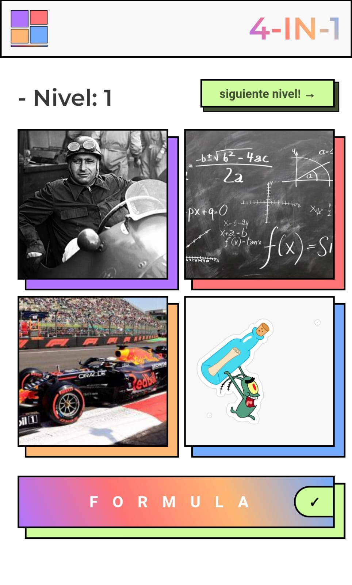

# 4-IN-1

4 in 1 is a game where there are 4 images and you have got to think a word that is relationated with the images
If you guess correct you pass to the next level.

Note: The DB is on a JS file, yeah... I know xD

This project was bootstrapped with [Create React App](https://github.com/facebook/create-react-app).